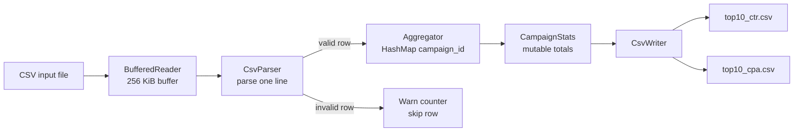
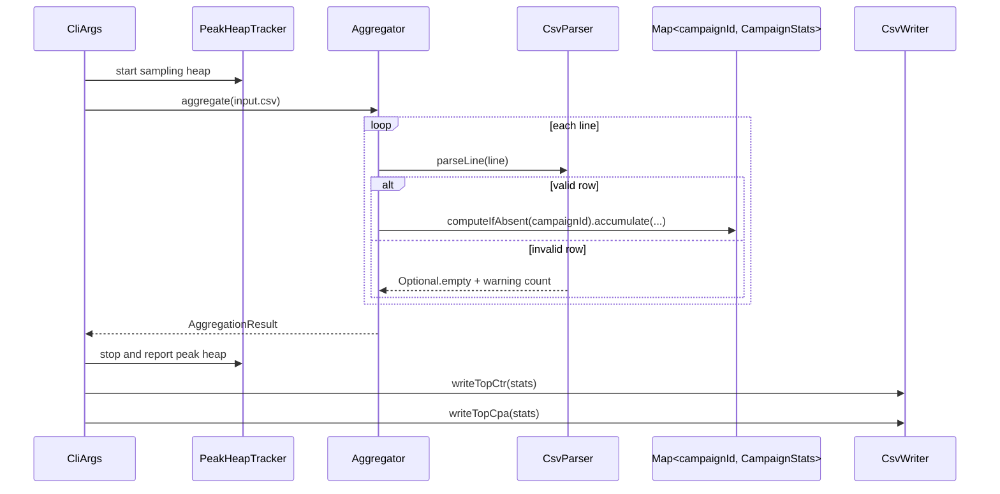
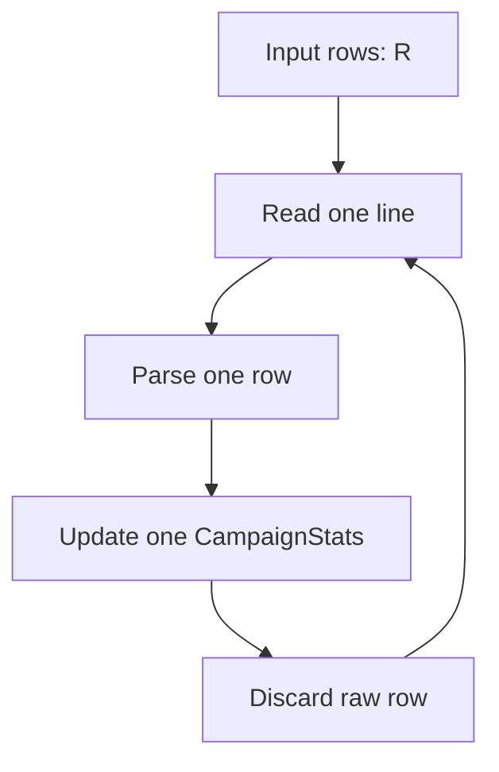
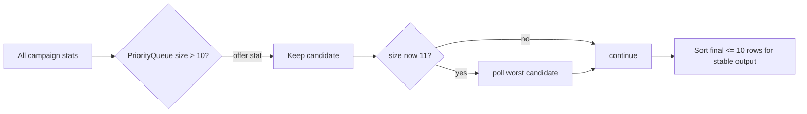
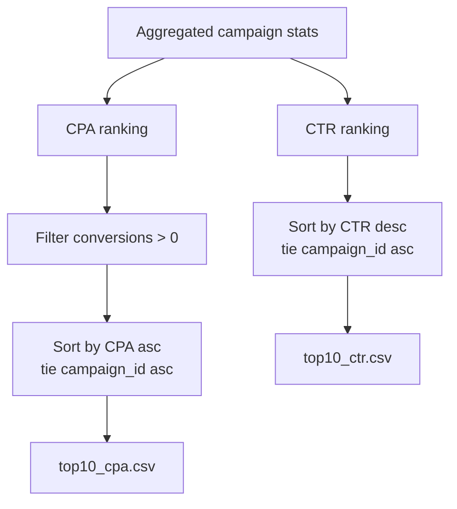

# Architecture Notes

This document explains how the CLI processes a large CSV file with predictable memory use and simple code structure.

## Key Design Decisions

| Problem | Decision | Why it matters |
|---|---|---|
| Input is near 1 GB | Stream with `BufferedReader` | File size does not drive memory usage |
| Need aggregate by campaign | Keep one `CampaignStats` per campaign in `HashMap` | Memory is proportional to unique campaigns, not rows |
| Need top 10 CTR/CPA | Use size-10 `PriorityQueue` | Avoid full sorting all campaigns |
| Bad rows may exist | Skip malformed rows with warning cap | One bad row does not fail the whole job |
| CLI should stay readable | Use `Picocli` | Avoid custom argument parsing code |

The most important optimization is the combination of streaming aggregation and heap-based top-N selection:

```text
CSV rows:        O(R) streaming pass
Campaign memory: O(C)
Top-N ranking:   O(C log 10), not O(C log C)
```

`R` is total CSV rows. `C` is unique campaign count.

## High-Level Flow



The input is streamed line by line. The app never loads the full CSV into memory. Only one parsed row and the campaign aggregate map are kept during processing.

## Data Processing Pipeline



## Optimization Strategy

### 1. Stream, Do Not Load

The core optimization is streaming the CSV with `BufferedReader`. This keeps memory independent from file size. A 1 GB file and a 10 GB file follow the same memory model as long as the number of unique campaigns is similar.



Memory complexity is `O(C)`, where `C` is the number of unique campaign IDs, not `O(R)` where `R` is the number of CSV rows.

### 2. Aggregate Into Mutable Counters

Each campaign has one `CampaignStats` object. New rows mutate totals in place:

- `totalImpressions += impressions`
- `totalClicks += clicks`
- `totalSpend += spend`
- `totalConversions += conversions`

This avoids storing raw rows or creating intermediate collections.

### 3. Keep Top 10 With a Fixed-Size Heap

The first implementation can sort all campaigns and take the first 10:

```text
full sort: O(C log C)
```

The current implementation uses a `PriorityQueue` of size 10:

```text
heap top-N: O(C log 10)
```



The final sort is still used, but it sorts at most 10 rows, not all campaigns.

### 4. Fail Soft on Bad Rows

`CsvParser` skips malformed rows instead of stopping the full job. It emits warnings for the first 100 bad rows, then suppresses repeated warning noise and reports the final skipped count.

This is useful for large CSV jobs where a few bad rows should not block all usable output.

## Package Responsibilities

```text
src/main/java/com/flinters/adperf/
|-- Main.java                         Entry point
|-- cli/CliArgs.java                  CLI arguments, validation, orchestration
|-- parser/CsvParser.java             Line parser, fail-soft row validation
|-- parser/ParsedRow.java             Immutable parsed row record
|-- aggregator/Aggregator.java        Single-pass streaming aggregation
|-- aggregator/AggregationResult.java Aggregation result record
|-- model/CampaignStats.java          Mutable accumulator per campaign
|-- calculator/MetricsCalculator.java CTR and CPA formulas
|-- writer/CsvWriter.java             Top-N ranking and output writer
`-- util/PeakHeapTracker.java         Lightweight peak heap sampler
```

Tests live in `src/test/java/com/flinters/adperf/` and mirror the production package layout.

## Complexity

| Step | Time | Memory | Notes |
|---|---:|---:|---|
| Read CSV | `O(R)` | `O(1)` | One line at a time |
| Parse rows | `O(R)` | `O(1)` | Fixed 6-column schema |
| Aggregate | `O(R)` | `O(C)` | One accumulator per campaign |
| Top 10 CTR | `O(C log 10)` | `O(10)` | Fixed-size heap |
| Top 10 CPA | `O(C log 10)` | `O(10)` | Excludes zero-conversion campaigns |
| Write outputs | `O(10)` | `O(1)` | Two small CSV files |

`R` = CSV data rows. `C` = unique campaign IDs.

## Output Rules



- `top10_ctr.csv`: highest CTR first.
- `top10_cpa.csv`: lowest CPA first.
- CPA excludes campaigns with `total_conversions == 0`.
- Ties are ordered by `campaign_id` for deterministic output.

## Libraries

| Library | Version | Purpose |
|---|---|---|
| [Picocli](https://picocli.info) | 4.7.5 | CLI argument parsing |
| [JUnit Jupiter](https://junit.org/junit5/) | 5.10.1 | Unit and integration tests |
| [Maven Shade Plugin](https://maven.apache.org/plugins/maven-shade-plugin/) | 3.5.1 | Fat JAR packaging |

No external CSV library is used because the expected schema is fixed and simple. This keeps parsing direct and avoids extra abstraction in the hot path.

## Benchmark Rationale

Benchmark tooling lives in [`../benchmark/run_benchmarks.py`](../benchmark/run_benchmarks.py) and writes [`../benchmark/benchmark_log.md`](../benchmark/benchmark_log.md).

The benchmark covers:

- small generated datasets for smoke validation,
- larger generated datasets for throughput,
- real `ad_data.csv` when present at the repo root,
- peak heap reported by `PeakHeapTracker`,
- a separate top-N comparison between full sort and `PriorityQueue`.

The real file has only 50 unique campaigns, so it mainly tests streaming throughput. The top-N optimization is better measured with high-cardinality generated data, where campaign count is large enough for sorting cost to matter.
